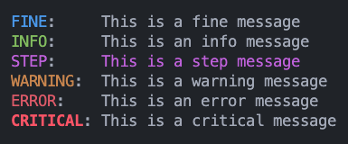

# Logger Documentation

## Installation

Install the package directly from GitHub:

```terminal
pip install git+https://github.com/caseywschmid/modules.git#subdirectory=modules/logs/logger
```

## Features

- **Custom Log Levels**: Includes custom log levels such as `FINE` and
  `STEP` to provide more granularity than the standard logging levels.
- **Color-Coded Console Output**: Uses color coding in the console output to
  distinguish between different log levels.
- **Optional Detailed Output**: Can toggle detailed output in the console that
  includes timestamps, logger names, and file locations.
- **File Logging**: Supports file logging with rotation, keeping backups of log
  files.

## Custom Log Levels

- `FINE`: A log level between `DEBUG` and `INFO`, with a value of 15.
- `STEP`: A log level between `INFO` and `WARNING`, with a numeric of 25.

## Configuration

The logging configuration is set up when the module is imported, but can be
reconfigured dynamically if needed. You can set and change the log level of your
project by setting the `LOG_LEVEL` environment variable to the desired numerical
level.

## Default Configuration

By default, the logger is configured to:

- Set the log level to `FINE` (15).
- Output logs to the console with color formatting.
- Optionally output detailed logs to files (commented out by default).

## Console Output Formatting

The console output is color-coded based on the log level:



| Name     | Color    | Level |
| -------- | -------- | ----- |
| DEBUG    | Grey     | 10    |
| FINE     | Blue     | 15    |
| INFO     | Green    | 20    |
| STEP     | Purple   | 25    |
| WARNING  | Orange   | 30    |
| ERROR    | Red      | 40    |
| CRITICAL | Bold Red | 50    |

## File Output Formatting

File logging is set up to rotate logs when they reach 5MB and keep up to 3
backups. The detailed format includes timestamps, logger names, log levels, and
file locations. This feature is disabled by default. You can enable it for a
particular file by running `configure_logging(keep_logs=True)`.

## Usage

Best practice is to set some kind of constant in your main file to set the log
level. This way you can easily change the log level for all files by changing
the constant in one place. Files though can be set to a custom log level if you
choose. To use the configured logger in your Python files:

```python
import logging
from CWS_Logger import logger

# you can set an environment variable to change the log level
# LOG_LEVEL = 15
logger.configure_logging(__name__, keep_logs=True)
log = logging.getLogger(__name__)

log.debug("This is a debug message")
log.fine("This is a fine message")
log.info("This is an info message")
log.step("This is a step message")
log.warning("This is a warning message")
log.error("This is an error message")
log.critical("This is a critical message")
```
